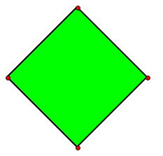
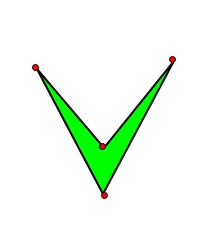

# smart_shape

Interactive vector shapes for Web

# Intro

Smart shape is a polygon (array of connected points) which can be attached to specified HTML node and displayed on top of it container. These figures are interactive and user can move them inside the container or edit them by moving points to change a shape of figure.

# Install

To start using SmartShape, need to include `smart_shape.js` script to a web page:

```html
<script src="<path-to-file>/smart_shape.js"></script>
```

This will add `SmartShape` object, that can be used to create figures.

Also, if you use a JavaScript framework with loadable module support, then you can load SmartShape as a module in a Javascript file the following way:

```javascript
import SmartShape from "<path-to-file>/smart_shape_module.js";
```

# Use

When script is loaded, you have a `SmartShape` class, that is ready to be used. However, smart shapes can be added only inside a container. Container is any html element, that should exist on a web page.

```html
<div id="surface" style="width:100%;height:400px"></div>
```

Then you can construct your first shape and add it to existing container:

```javascript
const div = document.getElementById("surface");
const shape = new SmartShape();
shape.init(div,{fill:"#00ff00"},[ [0,100],[100,0],[200,100],[100,200] ]);
```

This code creates new `shape` object and initializes it by `init` method:

```javascript
SmartShape.init(container_node,options,array_of_points);
```

* `container-node` - HTML DOM element to inject figure into
* `options` - Javascript object with options, that defines look and behavior of shape. For exampe, {fill:'#00ff00'} means that shape must be filled with light green color
* `array_of_points` - array of points of polygon where each point is a subarray of it's coordinates [x,y].

After running HTML page with code above, you should see this:



You can use mouse to drag and drop this shape to any place inside container. Also, the points marked by red circles. You can drag these circles to change a shape of figure. For example, like this:



The full code of this demo is available [here](./demo.html).

Also, you can create many more complex shapes and add them to the same or to different containers. See the demo [here](https://code.germanov.dev/smart_shape/index.html)

# Options

You can provide different options in a second parameter of `init` function to change look and behavior of the shape. This is a list of options, which is available to change now


| Option          | Description                                                                            | Default         |
|-----------------|----------------------------------------------------------------------------------------|-----------------|
| name            | Name of shape                                                                          | `Unnamed shape` |
| fill            | Background color of shape                                                              | `none`          |
| stroke          | Border color of shape                                                                  | `rgb(0,0,0)`    |
| strokeWidth     | Line thickness of shape border                                                         | 2               |
| offsetX         | Number of pixels added to X coordinate of each point to move whole shape to the right  | 0               |
| offsetY         | Number of pixels added to Y coordinate of each point to move whole shape to the bottom | 0               |
| maxPoints       | Maximum number of points that can be visually added to the shape                       | -1 (unlimited)  |
| canDragPoints   | Is it allowed to drag each point to change the shape                                   | true            |
| canAddPoints    | Is it allowed to add new points to the shape by double mouse click                     | false           |
| canDeletePoints | Is it allowed to delete points from the shape by right mouse click                     | false           |

# Plans and Contribution

This is a very new component, that I pushed today. A lot of new features to come. Follow this repository to get updates as soon as I push them. 

If you are interested to use it in your project, just fork this repository and use. If you modify the code by adding some great features to these shapes, I will be more than happy if you share your code with my repository. 

If you find bugs or have some great ideas to add here, feel free to post a message on `Disussions` tab of this repo. Perhaps I will include it to development plan.

The development plan is public and available here: https://github.com/users/AndreyGermanov/projects/1/views/1 .


